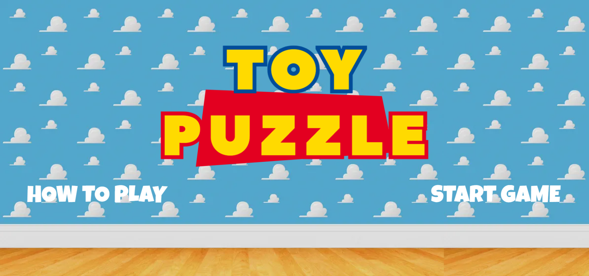

## Toy Puzzle

### Project Overview

This game was created as part of my project for General Assembly's Software Engineering Immersive Unit 1 - Fundamentals of Software Engineering.

The following phases were done prior to project completion.

- Researching on game ideas
- Deciding on the game and theme
- Gathering the resources required for the game such as images, font. tool to cut image.
- Doing up the wireframe in [Figma](https://www.figma.com/file/h3fJhILv8lrjYmBFe2fqpJ/Toy-Puzzle?type=design&node-id=0-1&mode=design&t=6qomrLaxDyB7igRg-0)
- Project proposal to instructors
- Working on the code
- Project presentation

### Description

This toy puzzle game works similarly to the slide puzzle game where players rearrange shuffled tiles to form a complete image. The theme for this game is Toy Story from Pixar. It is a challenging yet entertaining game that requires logical thinking and strategic movements.

### Screenshots of Game

### Technologies Used

- HTML & CSS: Used for creating the user interface and styling the game
- JavaScript: Used for implementing the game logic, including drag and drop functions, randomly choosing image, shuffling the tiles, getting the tile positions, determining the tiles adjacent to the blank tile and the win/game over logic.

### Getting Started

To play the toy puzzle game, simply open the [game](https://odebear27.github.io/toy-puzzle/index.html) in your web browser and start solving the puzzle!

### Next Steps

- Add music
- Implement Level 3 of game (5x5)

### Development Environment

This game was created on Windows 10 machine with a display resolution of 1920 x 1080, tested on Google Chrome browser Version 121.0.6167.187.

While efforts have been made to ensure compatibility across different screen sizes and browsers, there may be variations in styling and performance depending on your specific environment.

### References

1. https://www.w3schools.com/js/default.asp

2. https://developer.mozilla.org/en-US/docs/Web/API/HTMLElement for the drag, dragend, dragenter, dragleave, dragover, dragstart and drop events.

### Credits

I would like to acknowledge the below websites for the use of images and/or header image generation in my project.

1. Background Image: https://wallpapers.com/wallpapers/toy-story-cloud-vlir1rrcz78all06/download

2. Images for the Puzzle: https://www.disneyclips.com/images/toystory.html

3. Headers: https://www.textstudio.com/logo/toy-story-logo-843

4. Tool to cut image: https://www.imgonline.com.ua/eng/cut-photo-into-pieces.php
